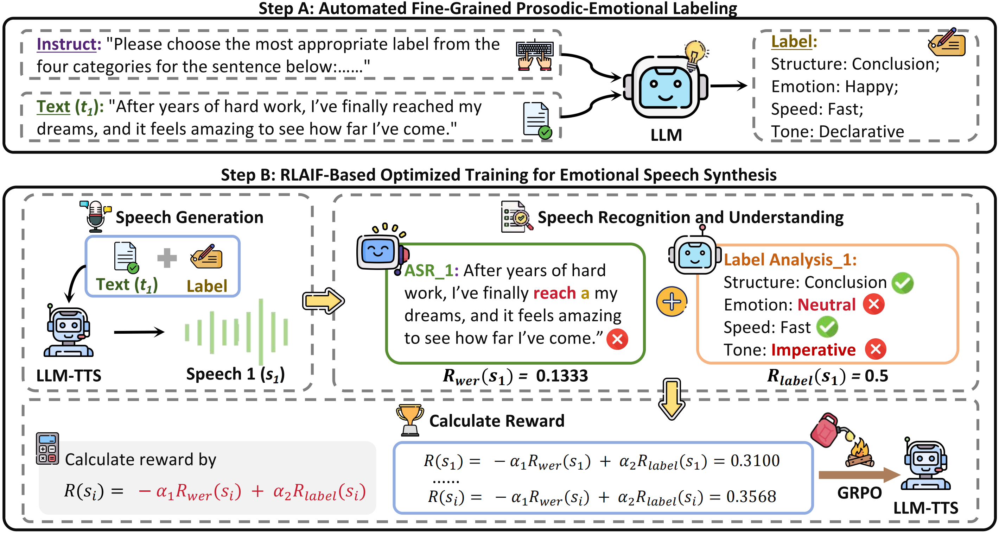

# RLAIF-SPA: Structured AI Feedback for Semantic-Prosodic Alignment in Speech Synthesis

[](https://arxiv.org/abs/2510.14628)
[](LICENSE)

> 🎭 **RLAIF-SPA** employs Reinforcement Learning from AI Feedback to optimize emotional speech synthesis, achieving both **emotional expressiveness** and **intelligibility** without costly manual annotations.

---

## 📋 Table of Contents

- [Overview](#-overview)
- [Features](#-features)
- [Installation](#-installation)
- [Quick Start: Inference Only](#-quick-start-inference-only)
- [Full Training Pipeline](#-full-training-pipeline)
- [Project Structure](#-project-structure)
- [Citation](#-citation)
- [Acknowledgments](#-acknowledgments)

---

## 🌟 Overview

<p align="center">
  
</p>

RLAIF-SPA is a novel framework that incorporates **Reinforcement Learning from AI Feedback (RLAIF)** for emotional speech synthesis. Our approach:

- 🎯 Jointly optimizes **emotional expressiveness** and **intelligibility**
- 🤖 Uses AI models (ASR + LLM) to generate reward signals automatically
- 📊 Employs fine-grained prosodic labels across 4 dimensions: **Structure**, **Emotion**, **Speed**, and **Tone**
- 🚀 Achieves **26.1% WER reduction** and **9.1% SIM-O increase** over Chat-TTS

---

## ✨ Features

- **🎨 Fine-grained Emotional Control**: Control speech across Structure, Emotion, Speed, and Tone dimensions
- **🔊 High Intelligibility**: Direct WER optimization ensures clear and accurate speech
- **🤖 Automated Labeling**: Uses GPT-4o for prosodic-emotional label generation
- **📈 GRPO Optimization**: Group Relative Policy Optimization for stable training
- **🎯 AI Feedback Mechanism**: Combines Whisper (ASR) and Qwen2-Audio for reward signals

---

## 🛠️ Installation

### Prerequisites

- Python 3.8+
- CUDA-compatible GPU (recommended)
- Conda/Miniconda

### Setup Environment

```bash
# Clone the repository
git clone https://github.com/Zoe-Mango/RLAIF-SPA.git
cd RLAIF-SPA

# Create conda environment from yml file
conda env create -f RLAIF-SPA-environment.yml
conda activate rlaif-spa
```

### Download Required Models

Download the following pre-trained models:

- **MiniCPM-O 2.6**: [Hugging Face](https://huggingface.co/openbmb/MiniCPM-o-2_6)
- **Whisper-Large-v3**: [GitHub](https://github.com/openai/whisper)
- **Qwen2-Audio**: [GitHub](https://github.com/QwenLM/Qwen2-Audio)
- **WavLM-Large**: [Hugging Face](https://huggingface.co/microsoft/wavlm-large)

Place models in appropriate directories and update paths in the code accordingly.

---

## 🚀 Quick Start: Inference Only

### Step 1: Prepare Your Data

Use the sample data provided in the `data/` folder, or prepare your own test data in JSONL format:

```json
{
  "id": "sample_001",
  "text": "After years of hard work, I've finally reached my dreams."
}
```

### Step 2: Load Pre-trained Checkpoint

Download our pre-trained checkpoint (if available) or use your own trained model:

```bash
# Set checkpoint path in inference.py
checkpoint_path = "/path/to/checkpoint"
```

### Step 3: Run Inference

```bash
python inference.py
```

**Configuration in `inference.py`:**

- `model_path`: Path to base MiniCPM-O model
- `lora_path`: Path to LoRA checkpoint
- `dataset_path`: Path to test JSONL file
- `output_path`: Directory for generated audio files

**Output:**

Generated audio files will be saved in the specified output directory with corresponding IDs.

### Example Usage

```python
# Basic inference example
from inference import generate_speech

sentence_data = {
    'id': 'test_001',
    'text': 'Hello, how are you today?'
}

generate_speech(sentence_data)
# Audio saved to: /RLAIF_SPA/baseline/test_001.wav
```

---

## 🎓 Full Training Pipeline

### Overview

The complete training pipeline consists of three main stages:

1. **📝 Prosodic-Emotional Labeling** (using GPT-4o)
2. **🎵 Audio Generation & Reward Calculation**
3. **🔄 GRPO-based Policy Optimization**

---

### Stage 1: Prosodic-Emotional Labeling

Generate fine-grained labels for your training data using `label.py`.

#### Prepare Input Data

Create a CSV file with columns: `id` and `text`

```csv
id,text
sample_001,"After years of hard work, I've finally reached my dreams."
sample_002,"The weather is beautiful today."
```

#### Run Labeling

```bash
python label.py
```

**Configuration:**

- Update `csv_file_path` to your input CSV path
- Update `output_file_path` for labeled output
- Set your OpenAI API key in the script

**Output Format:**

```json
{
  "id": "sample_001",
  "sentence_labels": {
    "sentence_number": 1,
    "sentence": "After years of hard work, I've finally reached my dreams.",
    "labels": "1. Structure: Conclusion\n2. Emotion: Positive\n3. Speech Speed: Medium Fast\n4. Tone: Declarative"
  }
}
```

---

### Stage 2: Prepare Training Environment

#### Set Up Qwen Audio Service

The training pipeline requires Qwen2-Audio for prosodic label analysis:

```bash
# Update paths in main_grpo.py
QWEN_AUDIO_ENV_PATH = "/path/to/anaconda3/envs/qwen_audio/bin/python"
QWEN_AUDIO_SCRIPT_PATH = "/path/to/qwen_audio_service.py"
```

#### Configure Output Directories

```python
OUTPUT_BASE = "/output"
AUDIO_OUTPUT_DIR = os.path.join(OUTPUT_BASE, "audio")
WER_RESULT_CSV = os.path.join(OUTPUT_BASE, "wer_result.csv")
AUDIO_LABEL_RESULT_JSON = os.path.join(OUTPUT_BASE, "audio_label_result.json")
```

---

### Stage 3: Training with GRPO

#### Basic Training

```bash
python main_grpo.py
```

#### Resume from Checkpoint

```python
# In main_grpo.py, set:
resume_from_checkpoint = "/path/to/checkpoint/step_7979"
```

#### Key Hyperparameters

```python
# Training Configuration
num_epochs = 10
train_batch_size = 1
lr = 5e-6
group_size = 4  # Number of rollouts per sample
checkpoint_interval = 20

# Reward Weights
kl_weight = 0.01  # KL divergence penalty
clip_eps = 0.2    # PPO clipping parameter

# Reward Composition
alpha_1 = 0.3  # WER penalty weight
alpha_2 = 0.7  # Label alignment reward weight
```

#### Multi-GPU Configuration

The code supports multi-GPU training. Configure devices in `main_grpo.py`:

```python
model_device = torch.device("cuda:6")      # Main training model
ref_device = torch.device("cuda:7")        # Reference model
whisper_device = torch.device("cuda:4")    # Whisper ASR
```

---

### Stage 4: Monitor Training

Training logs and outputs:

- **📊 WER Results**: `wer_result.csv` - Word Error Rate for each sample
- **🏷️ Label Analysis**: `audio_label_result.json` - Prosodic label matching results
- **🎵 Audio Samples**: `audio/` - Generated speech samples during training
- **💾 Checkpoints**: `checkpoint/` - Model checkpoints at intervals

#### Training Metrics

The training process logs:

- `reward_mean`, `reward_max`, `reward_min`: Reward statistics
- `WER_mean`: Average Word Error Rate
- `tag_reward_mean`: Average label matching reward
- `loss`, `kl`, `grad_norm`: Training dynamics
- `learning_rate`: Current learning rate

---

## 📁 Project Structure

```
RLAIF-SPA/
├── 📄 inference.py              # Inference script
├── 📄 label.py                  # Prosodic-emotional labeling
├── 📄 main_grpo.py             # Main training script (GRPO)
├── 📄 train_lora.py            # Alternative LoRA training
├── 📄 loss.py                  # GRPO loss implementation
├── 📄 replay_buffer.py         # Experience replay buffer
├── 📄 qwen_audio_service.py    # Qwen2-Audio analysis service
├── 📄 RLAIF-SPA-environment.yml # Conda environment
├── 📂 data/                    # Sample data
├── 📂 checkpoint/              # Model checkpoints
├── 📂 output/                  # Training outputs
│   ├── 📂 audio/              # Generated audio files
│   ├── 📄 wer_result.csv      # WER results
│   └── 📄 audio_label_result.json  # Label analysis
└── 📄 README.md               # This file
```

---

## 🔧 Advanced Configuration

### Custom Prosodic Labels

To customize label categories, modify the label maps in `qwen_audio_service.py`:

```python
structure_label_map = {
    'Introduction': 0, 'Background': 1, ...
}
emotion_label_map = {
    'Positive': 0, 'Negative': 1, ...
}
# Add your custom labels here
```

### Adjusting Reward Weights

Fine-tune reward composition in `main_grpo.py`:

```python
def compute_reward(wer_scores, tag_rewards):
    wer_complement = 1.0 - wer_scores
    rewards = 0.3 * wer_complement  # Adjust WER weight
    if tag_rewards is not None:
        tag_rewards_tensor = torch.tensor(tag_rewards, ...)
        rewards += 0.7 * tag_rewards_tensor  # Adjust label weight
    return rewards
```

---

## 📊 Evaluation

### Objective Metrics

- **WER** (Word Error Rate): Intelligibility measure
- **SIM-O** (Speaker Similarity): Voice consistency using WavLM
- **Emotion Accuracy**: Using emotion2vec model

### Subjective Evaluation

- **CMOS** (Comparative Mean Opinion Score): Overall quality
- **Emotion MOS**: Emotional fidelity
- **AB Preference Tests**: Comparative evaluation

---

## 🐛 Troubleshooting

### Common Issues

**1. CUDA Out of Memory**
```python
# Reduce group_size or batch_size in main_grpo.py
group_size = 2  # Default: 4
train_batch_size = 1
```

**2. Qwen Audio Service Fails**
```bash
# Check Python environment path
which python  # Should match QWEN_AUDIO_ENV_PATH
# Test service independently
python qwen_audio_service.py /path/to/test.wav
```

**3. Model Loading Issues**
```python
# Ensure all model paths are correct
model_path = "/absolute/path/to/MiniCPM-o"
lora_path = "/absolute/path/to/checkpoint"
```

---

## 📝 Citation

If you use RLAIF-SPA in your research, please cite our paper:

```bibtex
@article{yang2025rlaif,
  title={RLAIF-SPA: Optimizing LLM-based Emotional Speech Synthesis via RLAIF},
  author={Yang, Qing and Liu, Zhenghao and Wang, Junxin and Du, Yangfan and Huang, Pengcheng and Xiao, Tong},
  journal={arXiv preprint arXiv:2510.14628},
  year={2025}
}
```

**Paper Link**: [https://arxiv.org/abs/2510.14628](https://arxiv.org/abs/2510.14628)

---

## 🙏 Acknowledgments

This work builds upon several excellent open-source projects:

- [MiniCPM-O](https://huggingface.co/openbmb/MiniCPM-o-2_6) - Base LLM framework
- [Whisper](https://github.com/openai/whisper) - ASR model
- [Qwen2-Audio](https://github.com/QwenLM/Qwen2-Audio) - Audio understanding
- [WavLM](https://github.com/microsoft/unilm/tree/master/wavlm) - Speaker verification
- [Chat-TTS](https://github.com/2noise/ChatTTS) - TTS baseline

---

## 📧 Contact

For questions or issues, please:

- Open an issue on [GitHub](https://github.com/Zoe-Mango/RLAIF-SPA/issues)
- Contact the authors via email: yangqing_neu@outlook.com

---

## 📜 License

This project is licensed under the MIT License - see the [LICENSE](LICENSE) file for details.

---

<div align="center">

**⭐ If you find RLAIF-SPA helpful, please give us a star! ⭐**

Made with ❤️ by the NiuTrans Research Team

</div>